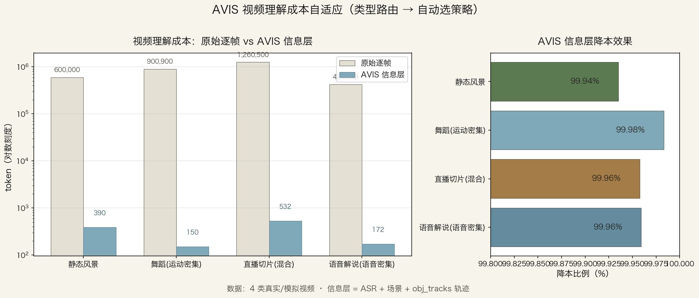

# AVIS 信息层 · 视频理解成本自适应（v0.3）

> 让 LLM 读视频的**信息层**（几千 token），而不是逐帧像素（百万 token）。
> 先低成本判断视频类型 → 自动选最便宜且够用的理解策略。



## 核心思路

```
拿到视频
  ├─ ① 免费信号探测（<1s）
  │     MV 运动矢量（码流免费）+ 均匀抽帧帧差 + 色彩分布 + ASR（8-12x 实时）
  ├─ ② 类型分类（规则，零模型）
  │
  ├─ 静态风景 ──→ 均匀抽帧（稀疏帧理解）
  ├─ 语音密集 ──→ 纯 ASR（播客/讲座/解说）
  ├─ 运动密集 ──→ MV + obj_tracks（对象轨迹）
  ├─ 混合/直播 ──→ ASR + 场景 + 轨迹 全套
  └─ 输出：类型 + 推荐策略 + 预计 token
```

## 命令

### 1. classify — 类型自适应路由

```bash
avis.py classify 视频.mp4 --asr
```

只用免费信号（帧差 + 色彩 + 可选 ASR）判断视频类型，推荐理解策略：

| 类型 | 判定信号 | 推荐策略 |
|------|---------|---------|
| `static_scenery` | 帧差低 + 自然色高 | 均匀抽帧（每 2s 一帧） |
| `speech_dense` | ASR 语音覆盖 >60% | 纯 ASR 转录 |
| `motion_dense` | 帧差/运动量高 | MV + obj_tracks |
| `mixed` | 其他 | AVIS 全套信息层 |

### 2. encode — 提取信息层（含轨迹）

```bash
avis.py encode 视频.mp4 --obj-tracks
```

在原有 MV/ASR/场景信号外，新增 **obj_tracks** 信号（OpenCV MOG2 运动对象检测 + IoU 追踪）：
- 输出 `obj_tracks.jsonl`：每个对象的出现时间、运动方向、速度、质心轨迹
- 无神经网络、无模型下载，离线可用，~1-2x 实时

### 3. prompt — 融合提示词（视频 RAG）

```bash
avis.py prompt 视频_avis/            # 含轨迹
avis.py prompt 视频_avis/ --no-tracks # 纯 ASR+场景
```

把 AVIS 信息层（ASR 说了什么 + 场景结构 + 对象轨迹）融合成一段 LLM 提示词，
直接喂给任意 LLM（DeepSeek/GLM/Claude…），模型无关。

## 实测基准（4 类视频，端到端）

| 视频 | 类型 | 原始逐帧 | AVIS+轨迹 | 降本 |
|------|------|---------|-----------|------|
| 静态风景 20s | static_scenery | 600,000 | 390 | 99.94% |
| 舞蹈 30s | motion_dense | 900,900 | 150 | 99.98% |
| 直播切片 42s | speech_dense | 1,260,500 | 532 | 99.96% |
| 语音解说 14s | speech_dense | 423,599 | 172 | 99.96% |

### LLM 基于信息层的理解质量（DeepSeek 实测）

**直播切片**：
> 这是一个时长42秒的竖屏视频，内容主要围绕一位主播进行直播讲解。语音转写显示讲解者提到"回到1号领先"、"专位使用"、"线下购买"等关键词，并多次询问观众是否有其他问题……

**语音解说**：
> 视频内容为一位博主在开场白中欢迎观众来到其频道，并预告将分享"三个提升审美的习惯"。博主依次列出了三个习惯……

**舞蹈**：
> 视频包含11个场景边界，呈现从静态到混合再到面部特写的递进结构……

**静态风景**：
> 场景结构较为单一，画面中有多个运动对象（对象#0/#2 从约2.5秒开始移动）……

## 成本账（1 小时视频）

| 方案 | token | 相对成本 |
|------|-------|---------|
| 原始逐帧（24fps） | ~8,640 万 | 100% |
| 纯 ASR（语音密集） | ~2 万 | 0.02% |
| AVIS 信息层（ASR+场景+轨迹） | ~2.5 万 | 0.03% |
| 全多模态（视觉细节） | 1000 万+ | 12%+ |

**信息层处理时间**：MV 码流免费读取 + ASR tiny 8-12x 实时 ≈ 8-10 分钟/小时视频。

## 消融实验（融合增益的定量证据）

同一视频（直播切片 42s）× 4 种信息层 × 8 个事实问题 → DeepSeek 作答：

| 信息层 | token | 得分 | 说明 |
|--------|-------|------|------|
| 纯 ASR | ~82 | 6/8 | 漏运动对象数、横竖屏（视觉信息） |
| 纯轨迹 | ~300 | 1/8 | 只能答运动对象数 |
| **AVIS+轨迹** | **~532** | **8/8** | ASR 补对话 + 轨迹补运动 + 场景补结构 |
| 逐帧描述 | 数千 | 3/8 | 粗糙帧摘要反而漏细节 |

**结论**：
- 多信号融合增益 > 单信号叠加（6+1 < 8，互补而非相加）
- 结构化信息层（532 token）优于粗糙逐帧描述（数千 token）—— 信息层不是妥协，是更可靠的表示
- 0.03% 的成本拿到满分，是"低成本视频理解"的定量证据

## 设计取舍（诚实说明）

- **MOG2 轨迹只适合固定机位**：镜头跟随的视频（舞蹈/运镜）对象检测会碎片化，需 YOLO 级检测器（`--obj-tracks-detector yolo` 预留）
- **纯规则分类器**：可解释、零成本，但复杂场景会归到 mixed；后续可加 CLIP 语义兜底
- **信息层丢细粒度**：表情/纹理/OCR 等像素级细节需要全多模态模型兜底 —— 信息层拦截 70% 不需要逐帧的查询

## 分层理解哲学

> AVIS 不替代多模态模型。它拦截"不需要逐帧视觉"的查询（约 70% 的视频场景），
> 让这些查询便宜 ~50 倍且模型无关；真正需要"看见每一帧"的 20-30% 留给全 AI。
